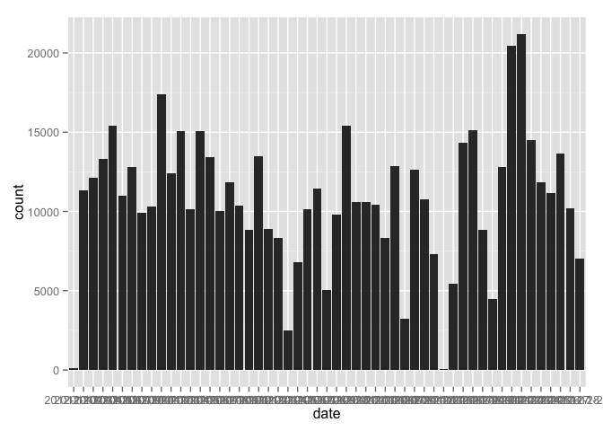
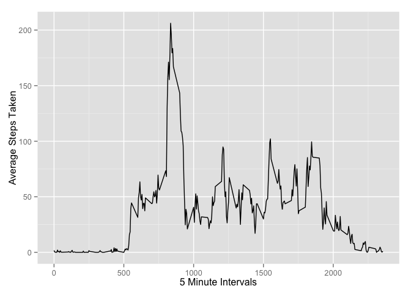

# Reproducible Research: Peer Assessment 1
## Libraries

```r
library( ggplot2 )
```

## Loading and preprocessing the data

```r
rawData <- read.csv( "activity.csv" )
```


## What is mean total number of steps taken per day?

```r
sumSteps <- aggregate( steps ~ date, data = rawData, FUN = sum )
## TODO: fix date label crowding!
qplot( date, data = sumSteps, weight = steps, geom = "histogram" )
```

 

```r
mean( sumSteps$steps )
```

```
## [1] 10766.19
```

```r
median( sumSteps$steps )
```

```
## [1] 10765
```

## What is the average daily activity pattern?

```r
avgStepsByInterval <- aggregate( steps ~ interval, data = rawData, FUN = mean )
ggplot( data = avgStepsByInterval, aes( x = interval, y = steps ) ) + geom_line() + xlab( "5 Minute Intervals" ) + ylab( "Average Steps Taken" )
```

 

## Imputing missing values


## Are there differences in activity patterns between weekdays and weekends?
