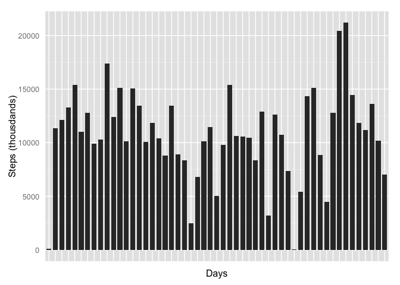
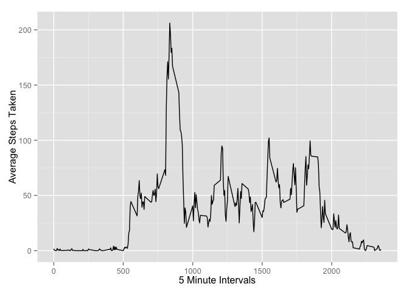
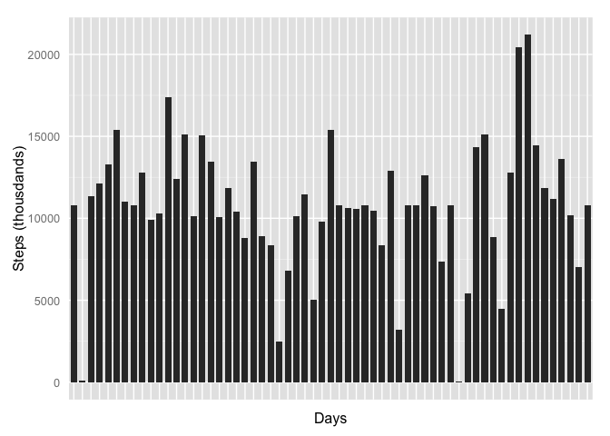
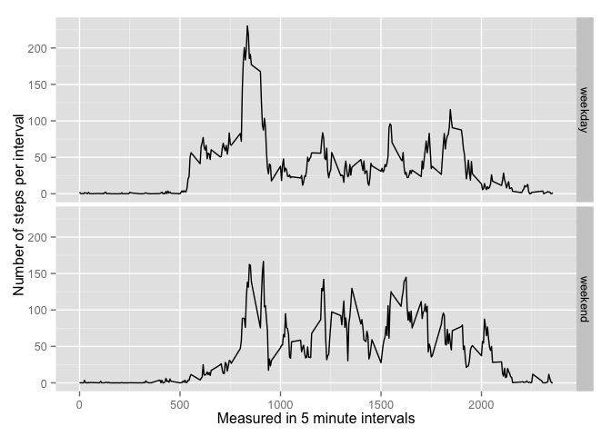

# Reproducible Research: Peer Assessment 1
## Libraries

```r
library( ggplot2 )
```

## Loading and preprocessing the data

```r
rawData <- read.csv( "activity.csv" )
```


## What is mean total number of steps taken per day?

```r
sumSteps <- aggregate( steps ~ date, data = rawData, FUN = sum )
## TODO: fix date label crowding!
qplot( date, data = sumSteps, weight = steps, geom = "histogram" )
```

 

```r
mean( sumSteps$steps )
```

```
## [1] 10766.19
```

```r
median( sumSteps$steps )
```

```
## [1] 10765
```

## What is the average daily activity pattern?

```r
avgStepsByInterval <- aggregate( steps ~ interval, data = rawData, FUN = mean )
ggplot( data = avgStepsByInterval, aes( x = interval, y = steps ) ) + geom_line() + xlab( "5 Minute Intervals" ) + ylab( "Average Steps Taken" )
```

 

```r
## TODO: reformat intervals as times?
```

## Imputing missing values
####1) Calculate number of rows with NA values

```r
nrow( rawData[ !complete.cases( rawData ), ] )
```

```
## [1] 2304
```
####2) I'm going to replace NAs with mean of interval

####3) Create dataset with NAs replaced by mean of interval

```r
replaceNasWithMean <- function( steps, interval ) {
    
    if ( !is.na( steps ) ) {
        return ( steps ) 
    } else {
        return( meanStepsByInterval[ meanStepsByInterval$interval == interval, "steps" ] )
    }
}

meanStepsByInterval <- aggregate( steps ~ interval, data = rawData[ complete.cases( rawData ), ], FUN = mean )
updatedData <- rawData
updatedData$steps <- mapply( replaceNasWithMean, updatedData$steps, updatedData$interval )
```

####4) Histogram of the total number of steps taken each day


```r
stepsByDate <- aggregate( steps ~ date, data = updatedData, FUN = sum )

ggplot( stepsByDate, aes( date, steps ) ) +
geom_bar( stat = "identity", fill = "grey", width = 0.75 )
```

 

```r
#TODO: Fix/remove cramped dates on x axis
```
####4.1) Calculate and report the mean and median total number of steps taken per day. 

```r
mean( stepsByDate$steps )
```

```
## [1] 10766.19
```

```r
median( stepsByDate$steps )
```

```
## [1] 10766.19
```
####4.2) Do these values differ from the estimates from the first part of the assignment? 

Yes.

####4.3) What is the impact of imputing missing data on the estimates of the total daily number of steps? 
It skews the median a bit.
 
## Are there differences in activity patterns between weekdays and weekends?

```r
weekOrWeekend <- function( date ) {
    
    day <- weekdays( date )
    
    if ( day %in% c( "Monday", "Tuesday", "Wednesday", "Thursday", "Friday" ) ) {
        return ("weekday")
    } else if ( day %in% c( "Saturday", "Sunday" ) ) {
        return ("weekend")
    } else {
        stop( "invalid date" )
    }
}
updatedData$date <- as.Date( updatedData$date )
updatedData$day <- sapply( updatedData$date, FUN = weekOrWeekend )

stepsPerIntervalDay <- aggregate( steps ~ interval + day, data = updatedData, mean )
#print( stepsPerIntervalDay )
ggplot( stepsPerIntervalDay, aes( interval, steps ) ) + 
    geom_line() + 
    facet_grid( day ~ . ) + 
    xlab( "Measured in 5 minute intervals" ) + 
    ylab( "Number of steps per interval" )
```

 
